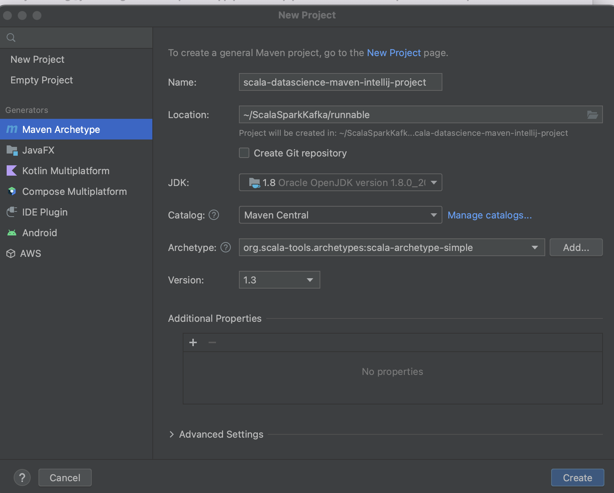
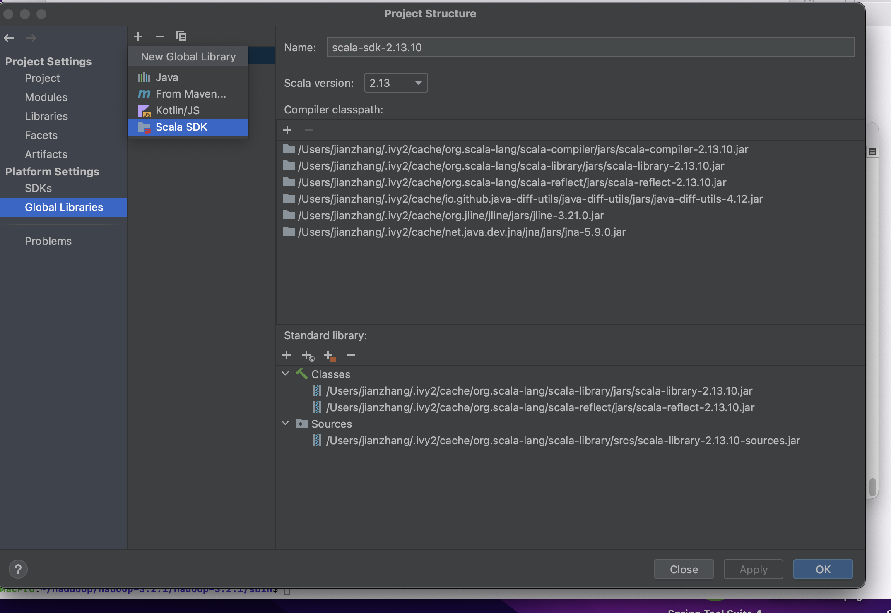
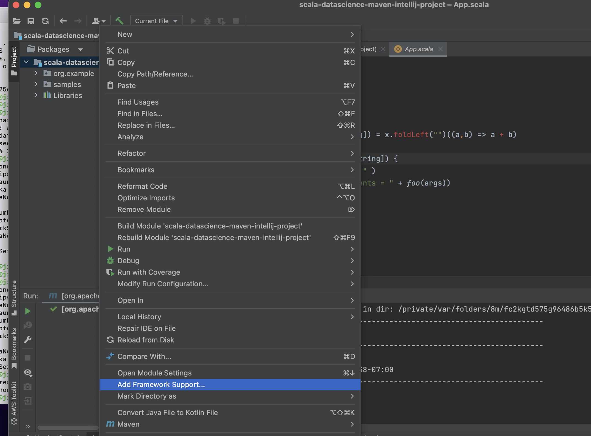

# scala-list-map-flatmap-filter-option-caseclass-maven-project

## Scala collection advanced transforms and case classes 
  Running the examples in intelliJ maven project for scala list, scala map, scala flatmap, scala filter, scala option and scala case class
  
  

## IntelliJ Maven project creation

  Download Intellij 2023 CE (Mac dmg file) , which support Scala already --> Create 'New Project' --> select'Maven Archetype'-->
  
  Category --> select 'Maven Central' --> in 'Archetype' input org.scala-tool --> select 'org.scala-tools.archetypes:scala-archetype_simple'
  
  -->Input your project name: 'scala-datascience-maven-intellij-project'
  
  

  -->Install plugin Scala (preference-->plugin -->search scala --> install) -->project setting-->global sdk -->add (+) scala -->
  
   --> delete test folder
  
  -->In pom.xml except your project group_id and artifact, replace all content with following pom.xml section  
  
        <version>1.0-SNAPSHOT</version>
        <inceptionYear>2010</inceptionYear>
        <inceptionYear>2010</inceptionYear>
        <properties>
          <maven.compiler.source>1.5</maven.compiler.source>
          <maven.compiler.target>1.5</maven.compiler.target>
          <encoding>UTF-8</encoding>
          <scala.version>2.13.0</scala.version>
        </properties>

        <dependencies>
          <dependency>
            <groupId>org.apache.spark</groupId>
            <artifactId>spark-core_2.13</artifactId>
            <version>3.2.1</version>
            <scope>compile</scope>
          </dependency>
        </dependencies>

        <build>
          <sourceDirectory>src/main/scala</sourceDirectory>
          <finalName>scala-spark-maven-example</finalName>
        </build>
      </project> 
       
 -->Run Pom.xml--> at this moment , you run main can in ...example , you must encount 'no main found' issue--> right click at your project name level
 
 --> select 'Add Framework Support' --> check 'Scala' --> note each time mvn clean install or no main found , you must do this operation
 
  
  
--> when you run main, you must get issue as 'scalac: bad option: '-make: transitive' --> got .idea directory -->in scala_compiler.xml file, remove -'make: transitive' properties, all error must be gone

 
  
